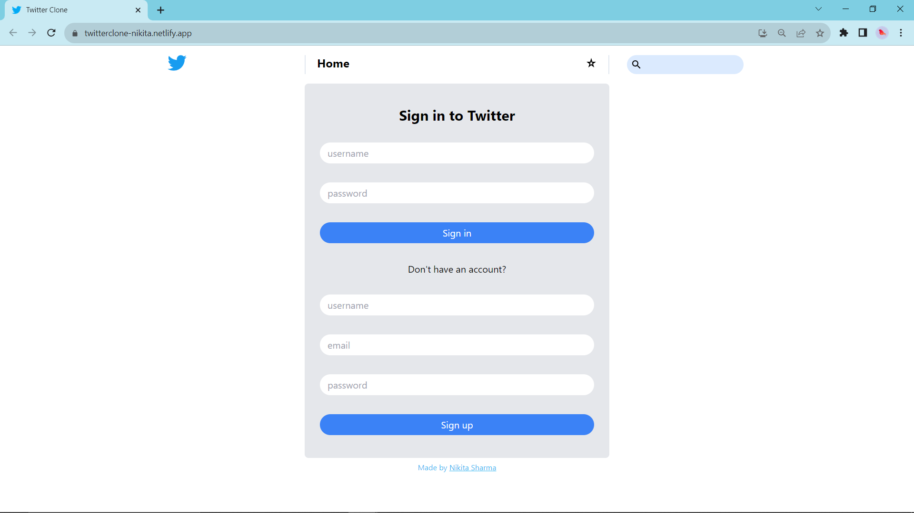
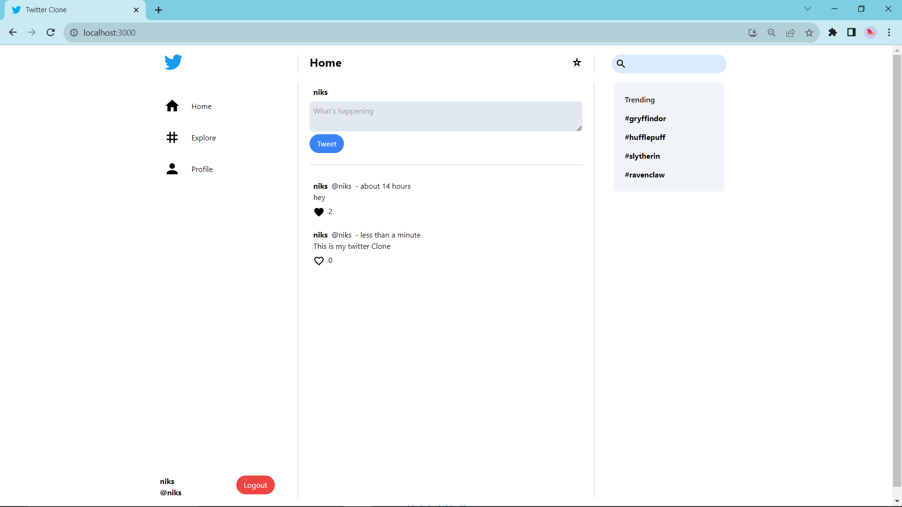
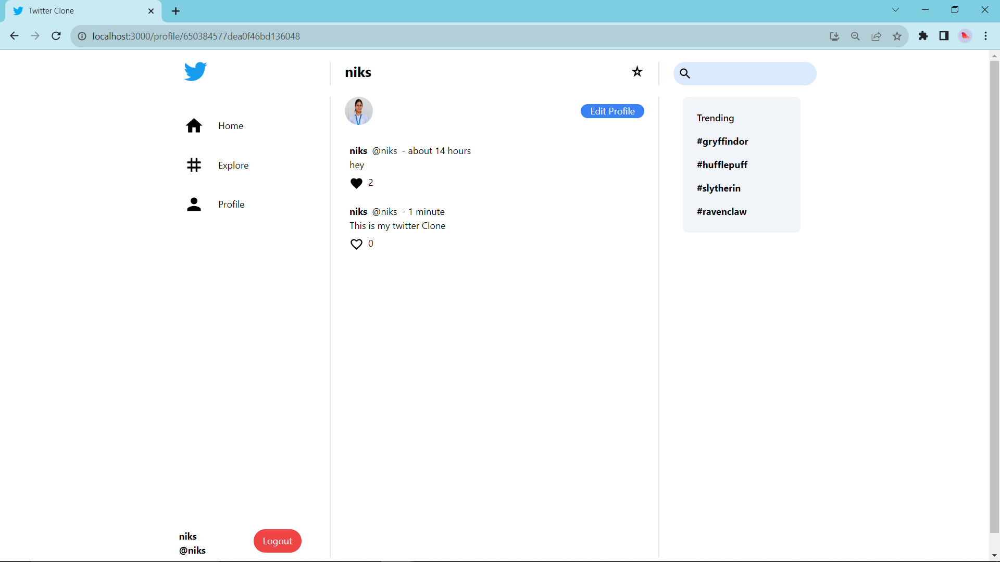
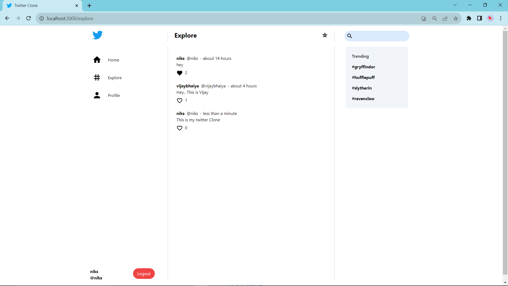

# Twitter Clone App (MERN Stack)

This is a simple  clone app built using the MERN (MongoDB, Express, React, Node.js) stack. You can use this readme to set up and run the app locally.

Hosted on  

## Checkout :   [TwitterClone By Nikita](https://twitterclone-nikita.netlify.app/)

## Prerequisites

Before you begin, ensure you have the following installed and set up on your machine:

- Node.js: Download and install Node.js from [nodejs.org](https://nodejs.org/).
- MongoDB: Install and configure MongoDB. You can get it from [mongodb.com](https://www.mongodb.com/).
- Firebase: Set up a Firebase project and obtain your Firebase configuration details. You can do this by visiting [Firebase](https://firebase.google.com/) and following their documentation.

## Getting Started

To run the Twitter clone app locally, follow these steps:

1. Install server dependencies:
cd server
npm install
2. Start the server:
npm start
3. Open a new terminal window, navigate to the client directory, and install client dependencies:
cd ../client
npm install
4. Install firebase
npm install firebase
5. Create a file named firebase.js in the client/src directory and add the Firebase configuration details
6. Start the client:
npm start

## Screenshots

### 1. On startup, Login page:

### 2. Feed page:

### 3. Profile Page:

### 4. Explore Section:

## Connect with me

